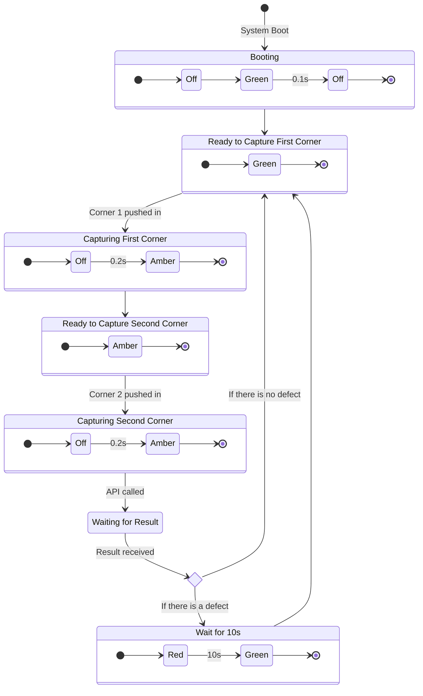

```mermaid
stateDiagram-v2
	booting : Booting
	state booting {
		direction LR
		o1 : Off
		g1 : Green
		o2 : Off
		[*] --> o1
		o1 --> g1
		g1 --> o2 : 0.1s
		o2 --> [*]
	}
	ready1 : Ready to Capture First Corner
	state ready1 {
		direction LR
		g2 : Green
		[*] --> g2
		g2 --> [*]
	}
	capturing1 : Capturing First Corner
	state capturing1 {
		direction LR
		o3 : Off
		a1 : Amber
		[*] --> o3
		o3 --> a1 : 0.2s
		a1 --> [*]
	}
	ready2: Ready to Capture Second Corner
	state ready2 {
		direction LR
		a2 : Amber
		[*] --> a2
		a2 --> [*]
	}
	capturing2 : Capturing Second Corner
	state capturing2 {
		direction LR
		o4 : Off
		a3 : Amber
		[*] --> o4
		o4 --> a3 : 0.2s
		a3 --> [*]
	}
	waiting : Waiting for Result
	state defect <<choice>>
	wait : Wait for 10s
	state wait {
		direction LR
		r1 : Red
		g3 : Green
		[*] --> r1
		r1 --> g3 : 10s
		g3 --> [*]
	}

	[*] --> booting : System Boot
	booting --> ready1
	ready1 --> capturing1 : Corner 1 pushed in
	capturing1 --> ready2
	ready2 --> capturing2 : Corner 2 pushed in
	capturing2 --> waiting : API called
	waiting --> defect : Result received
	defect --> wait : If there is a defect
	defect --> ready1 : If there is no defect
	wait --> ready1
```